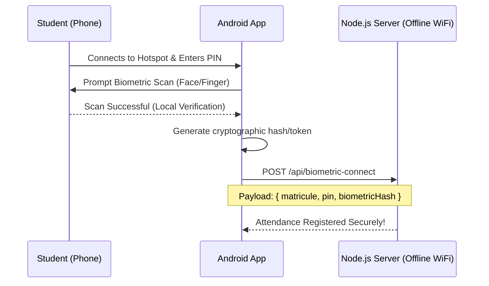

# Biometric API Offline Architecture

You asked: **"Is this possible offline?"**

**The short answer is: YES.**

Here is a detailed explanation of how it works and how we've implemented it in the server.

## How Biometrics Work Offline

Modern smartphones do not require an active internet connection to perform biometric authentication (Face ID on iOS, BiometricPrompt on Android).

1. **Hardware-Level Security**: Your fingerprint or facial map is securely stored in a specialized, isolated piece of hardware on the phone (the Secure Enclave for iOS, or Trusted Execution Environment for Android).
2. **Local Matching**: When the app requests a biometric scan, the phone compares the live scan against the stored data entirely on the device.
3. **No External Server Needed for Scanning**: The phone does *not* send your fingerprint image to an Apple or Google server to verify it. The verification is 100% local.

## System Architecture

Since the verification is local, we simply need a way to trust the phone's verification over our offline WiFi hotspot.

## Security Mechanism: Preventing "Friend Scanning"

To prevent a student from giving their phone to a friend:
- **Biometric Binding**: The app relies on the OS-level biometrics. A friend cannot scan their face because the phone only recognizes the owner's face.
- **The Biometric Hash**: Once the OS confirms a match, the app generates a specific `biometricHash`. This hash is sent to the Node.js server. 
- **Offline Delivery**: This hash, along with the student's `matricule` and the session `PIN`, is sent directly to the local Node.js server via the local WiFi hotspot (no internet required).

## The Server Implementation

We have added the following endpoint to `server.js` to support this future extension:

- **`POST /api/biometric-connect`**
    - Takes `username`, `matricule`, `email`, `sessionPin`, and the new `biometricHash`.
    - It verifies the hash (or logs it, if using a token-based approach) to securely check in the student.
    - Since this includes sensitive data transfer (the hash), we have also introduced **SSL (HTTPS)** so that data sent over the local WiFi network cannot be intercepted by packet sniffers.

## Summary

This setup guarantees that the physical student is present with their phone, without requiring an active internet connection for the server or the phones.
